sentry 翻译过来是 哨兵,寓意着像哨兵一样守护应用;
它是一个完善,开放的 error trace 工具,围绕"Stop hoping your users will report errors"的理念,提供一系列工具,帮助 coder 快速定位问题,发现问题,解决问题;

你的项目经常会遇到以下问题(如果没有遇到可以忽略此文,好幸运,[求交往](/about/)!):

- 需要用户的帐号密码才能复现问题;
- 用户那里有问题,在开发这边怎么也复现不了,也不清楚用户环境信息;
- 每次出问题都是从前端定位到后端,一系列流程之后才找到原因;
- 项目人员的更替流失,找不到谁维护项目;
- 每次出问题自己都是最后一个知道,经过客户,客服/售后,teamLeader or boss;
- 线上事故似乎总会冷不防的蹦出来,不能安安静静的写代码;
- 上线时出现问题,并不能第一时间发现,导致影响大批用户,不能把火情控制在最小范围;

......

coder 是为了解决问题而生的工程师, 如果上面的问题你遇到 3 个或 3 个以上,那很不幸,估计眼中噙着泪水, 心中一 W 个草尼马在奔腾;
然并卵,真不幸遇到了这些问题,该如何解决呢 ? 如何带领团队走出困境;

### 特性

对比了一票工具, 最终选择了 sentry,基于以下理由;

- [多端覆盖](https://docs.sentry.io/platforms/?platform=javascript): 我们能想到的语言也好端也好基本都有对应的 SDK, 像小程序也有社区提供的 SDK;
- coder style: 完整对接开发工具栈(github,jira,slack...),开放 openapi 支持扩展任意;连独立部署都提供 docker,真是不能太周到体贴;
- 产品细致到位: sourcemap,suspect commit,suggested assignees,alert rule 等在实际使用时让人倍感关怀,似乎能想到的,都已经做到;

下面会详细说明这些特性:

#### vocabulary

把 sentry 涉及到的词汇整理出来:

- Issue:与 githubissue 同义, 问题;一个 issue 可以发生多次 event;
- Event:一个问题发生的一次,会聚合到一个 issue;
- SourceMap:压缩后代码映射到压缩前的信息,可以获取在错误源代码的文件路径,行号 列号,有利于定位问题;
- FeedBack:用户反馈,当发生问题时,弹出对话框,可以让用户填写信息,描述错误影响及发生错误的场景;
- Release:发布的版本;
- Breadcrumb:童话里的面包屑,在问题发生之前的一些动作, 可以自己记录一些信息(用户点击动作),在 raven sdk 默认会把 console 打印信息记录下来,通过配置可以记录 http 请求 (https://docs.sentry.io/learn/breadcrumbs/)
- [Dsn( Data Source Name)](https://docs.sentry.io/quickstart/#about-the-dsn) 格式:https://<key>@sentry.io/<project>,包含上传协议,key 服务地址,项目标识
- Suspect Commit:commit 语义同 githubcommit,即一次提交,suspect commit 表示出现的问题可能与某次 commit 有关联;

#### 主动上报问题;

sentry 的基本职责,当出现问题时,把错误现场信息,一些调试必要的业务信息及用户信息带到服务端;
当采集一段时间,我们就能知道一段时间发生了多少错,某个版本发生了多少错,影响了多少用户;
再通过告警,让我们第一时间感知到问题所在,进行修复;
当用户或售后反馈时,我们可以坦然的说,"已经上线了!"或"正在上线中!";

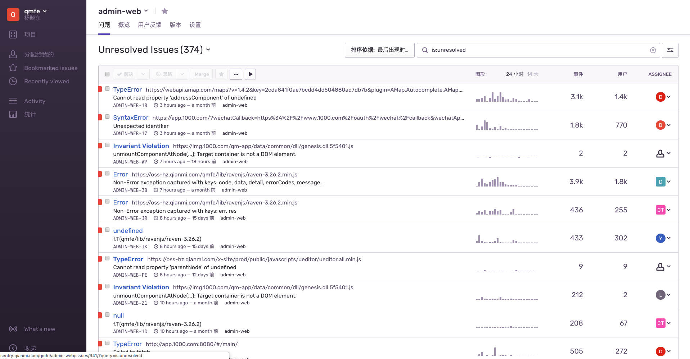

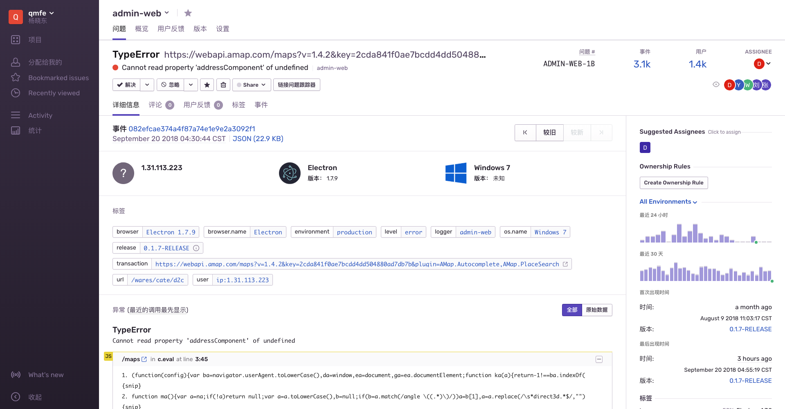

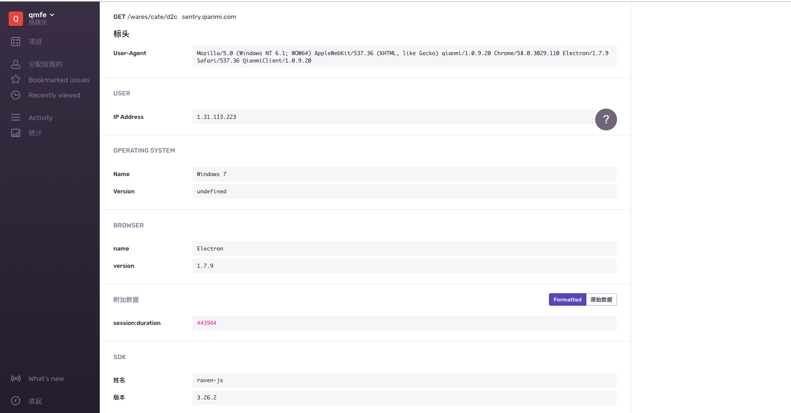

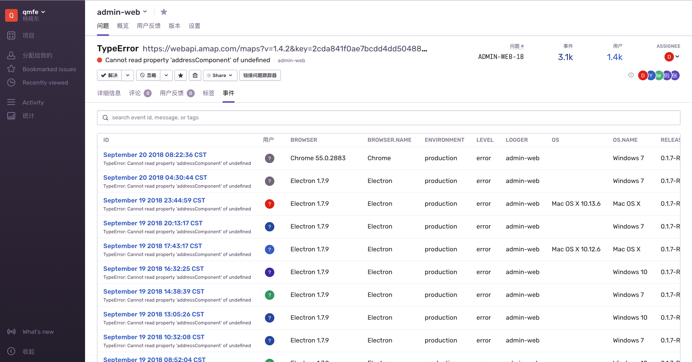

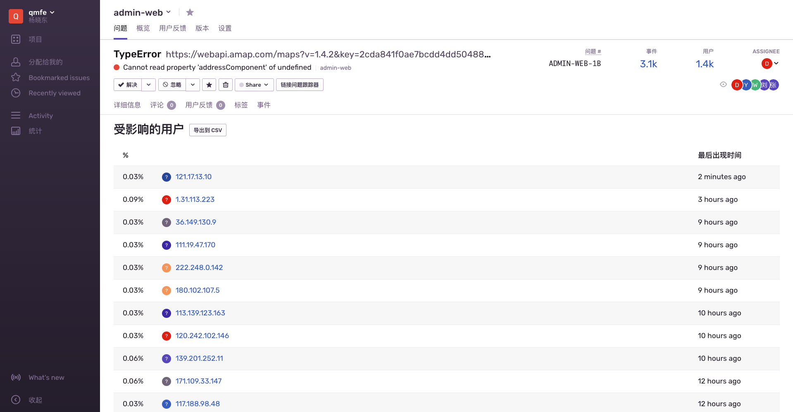


#### 如何与 github 完美结合

sentry 与 github 的结合与可谓深入浅出,浅在简单易用,深在巧妙利用 issue commit coder 的关联;
先问一个问题?sentry 与 github 结合能给我们带来什么?

1. 把问题相关的 commit 展示出来;
2. 选出最适合改这个 bug 的人;
3. 两个版本之间的 commit 列出来;

注:
第二项,完美实现了这些,当问题发生时,任何一个人都可以分配问题,而不是一定要 TeamLeader 来做这件事,

下面详细说明如何实现:

与此相关的概念: Issue,Event,Release,Suspect Commit;

首先在项目中授权项目的 github 地址;

当我们发布版本时,设置一个 hook 把版本及 coomit 信息通知到 sentry;

当采集到问题时, 把问题的版本 version 关联上来;

这样就完成了. 对, 就这么简单! 然后呢 ? 以 js 为例说明

首先,根据上传的问题 call stack 分析到是那个 js 出了问题;
然后根据 js 中 sourcemap 信息推断出源代码的 path line colume,方便用户调试;
接着分析源代码的相关 commit 及 coder;

然后一切就明清晰了;

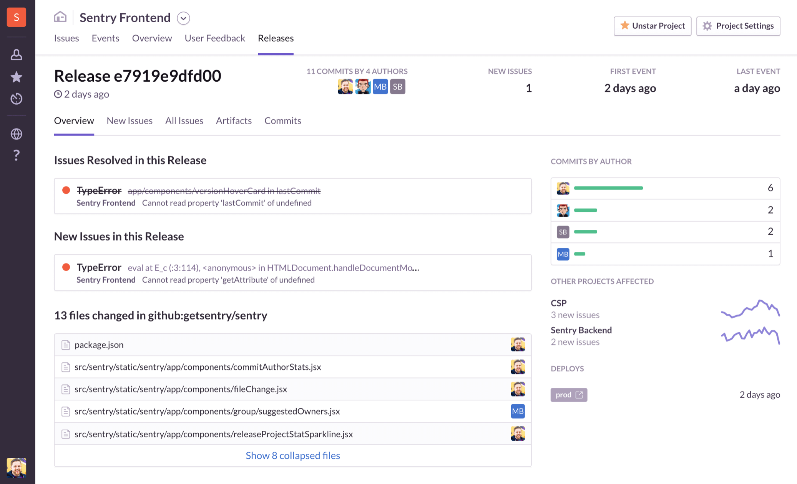

[开通流程参考](https://blog.sentry.io/2017/05/01/release-commits)

#### 多端覆盖

sentry 目前最新版本 9.0 算得上老牌厂商了, 我们能用得上的语言他基本都可以支持;小程序的采集与有社区贡献代码;

eg :javascript
```javascript
<script src="https://web-img.qmimg.com/qmfe/lib/ravenjs/raven-3.26.2.min.js"></script>
<script>
    Raven.config('https://<key>@sentry.io/<project>',
        { logger: "@qianmi/official-mobile", release: QM_VERSION, environment: "production" }).install()
</script>
```

eg:(reactNative)[https://docs.sentry.io/clients/javascript/integrations/react/]
```javascript
//index.ios.js
import { Sentry } from 'react-native-sentry';

Sentry.config(
  'https://8070a174f3ab4fe298d4c5516b3e2704@sentry.qianmi.com/7'
).install();
// set the user context
Sentry.setUserContext({
  email: '',
  userID: Config.ADMINID,
  username: Config.DEVICE.model,
  extra: {
    is_admin: false
  }
});

Sentry.setTagsContext({
  environment: 'production',
  react: true
});

Sentry.setEventSentSuccessfully(event => {
  console.log('发送错误', event);
});

```


##### 备注
[node java python ...接入](https://docs.sentry.io/platforms/?platform=javascript)

[小程序接入](https://github.com/youzan/raven-weapp):


#### [openapi](https://docs.sentry.io/api/)

借助于 openapi 几乎可以做到所有的事情(项目管理,issue 管理),像第三方工具对接,

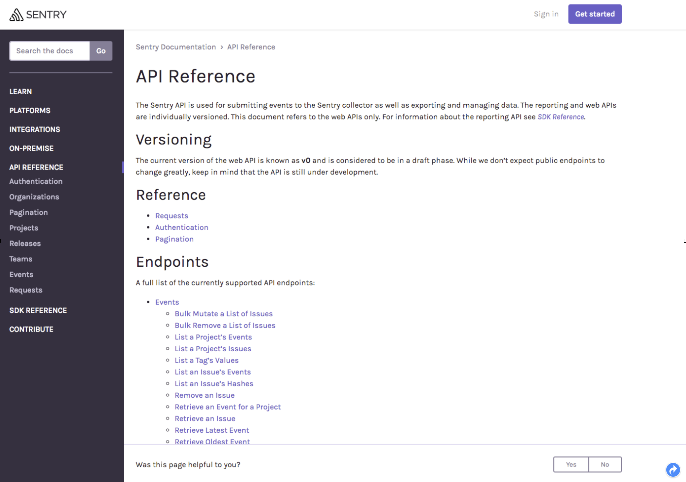

#### 问题处理流程

我们的愿景是对问题主动出击,那么如何实现主动,如何在第一时间感知问题?
sentry 提供了 email 与 webhook;基于 webhook 可以把问题简略信息发布到钉钉,企业微信或个人微信;让我们能第一时间感知

项目中肯定会有报错是低优先级的,不影响流程的,这种错误可以借助 sentry 统计起来, 一周或一个月集中处理;(这个时候是不是锻炼新队员的好时候,哈哈.)

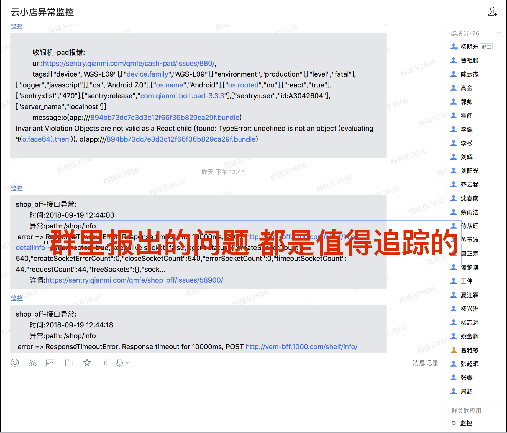
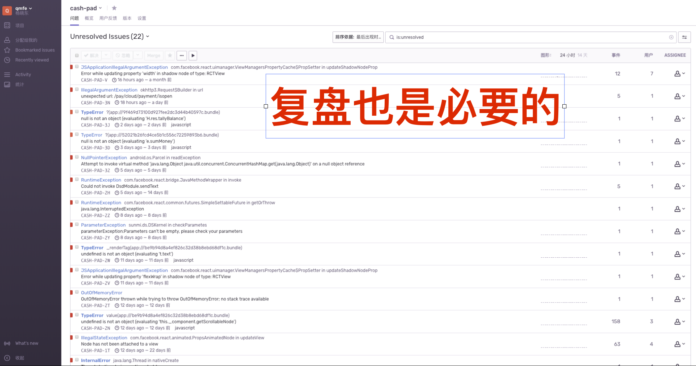

也许有经验的小伙伴会反驳,告警群里一直反馈问题不停的报警,会引发 coder 的反感,最终演化成"狼来了"的故事;
为了避免陷入这种困境,一定要有一个原则:"所报出的问题,都是有价值的,都是值得追踪的";
sentry 为我们提供了灵活的报警策略,实现这个目标:

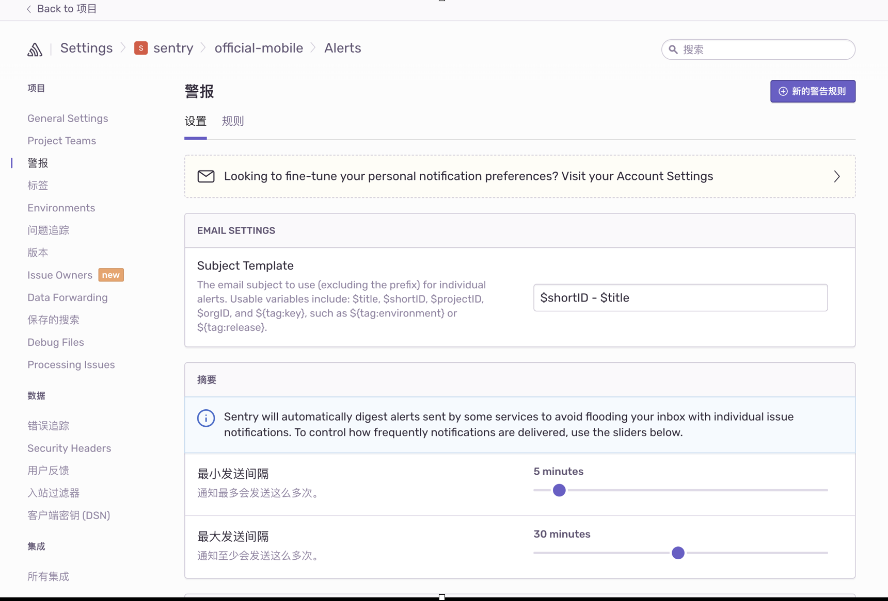
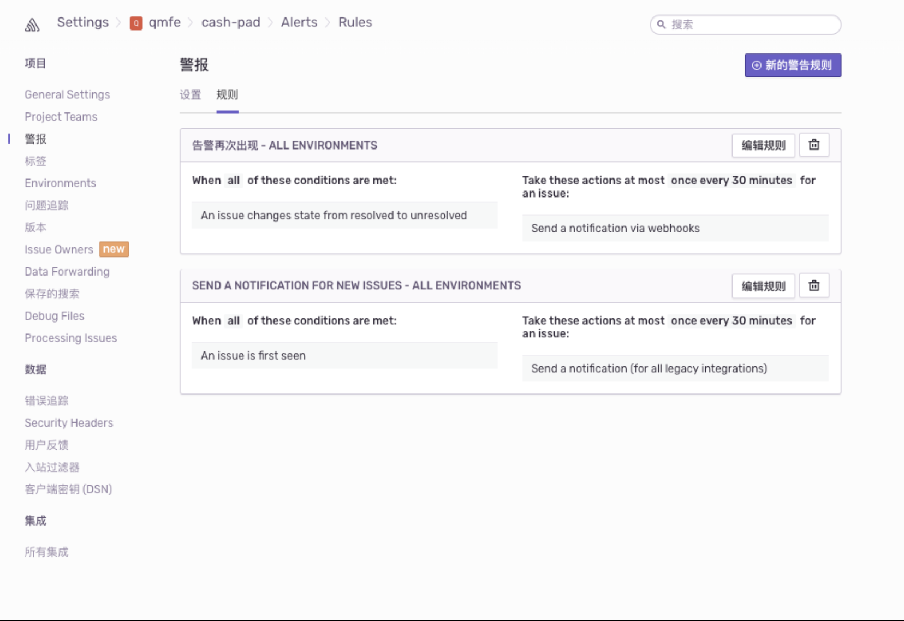

#### 服务端日志处理

服务端错误日志采集最好与官方提供的sdk进行结合,但目前已运行项目已经接入logserver,通过kafka进行消息传递,那么我们怎么办呢?;
通过监听kafka的日志消息将错误日志上报到sentry;
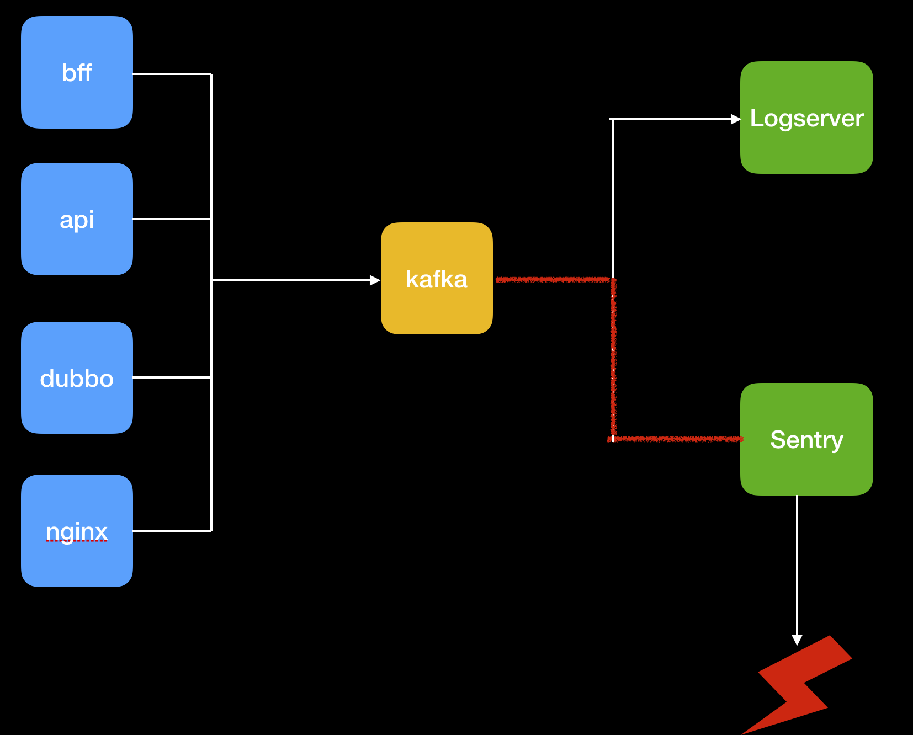;

优点:侵入小,无改动,只需监听消息便可以把所以错误消息导入;
缺点:错误异常栈,影响用户,代码版本,breadcrumb等信息皆无, 只有通过上报的一条消息; 另外每一个消息的fingerprint要自己提取设置, 不

参考资料:
[Multiple Instances & Capturing Messages](https://docs.sentry.io/clients/node/usage/?platform=javascript)


#### 部署
sentry sass服务注册帐号是直接可以使用的,但他的服务器是American,我们可以单独进行[部署](https://docs.sentry.io/server/installation/?platform=javascript)
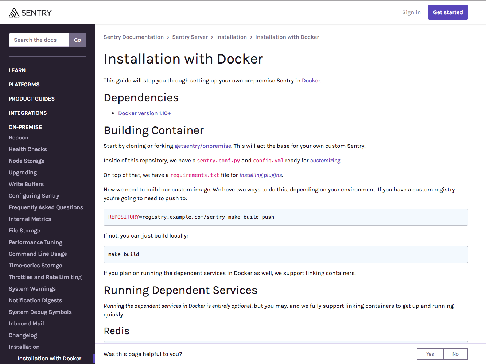;
文档 说的很详细不再赘述!

在部署的时间有一个有意思的事情 , sentry服务内部 的报错会上报给自己,这样当我们查一些问题通过上报的错误信息就知道发生了什么. 很棒,好的工具给人惊喜!

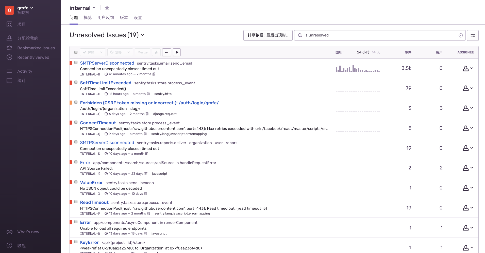;


问一句,如果拿开源代码这个在墙内部署,供其他人使用,是否有问题?  

## 总结

如果让我用一句话来总结 sentry,我想说:"改变了对问题的态度,从被 push 到 pull, 从此运筹帷幄,可以安安静静写代码!"

从此摆脱传话筒的尴尬局面;

## 问题

> 开源与 sass 的

## 相关资料
